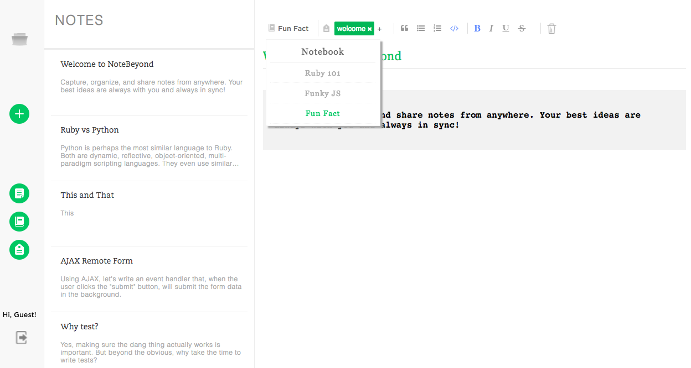

# NoteBeyond

[NoteBeyond](https://notebeyond.herokuapp.com/#/) is a note-editing application inspired by [Evernote](https://www.evernote.com). Technology framework and tools involved during development include but not limited to Ruby on Rails, PostGreSQL database and React/Redux. 

## Main Features

* New account creation, login, and guest/demo login, with secure authentification both on 	backend and front end  
* Users could create, edit and delete notes equipped with a built-in text editor
* Users could use Notebook to categorize and manage notes 
* Users could add and remove tag to organize notes 
* Notes are autosaved regularly 

## Screen Shots

